# Dokumentation Semesterprojekt Tobias Haas

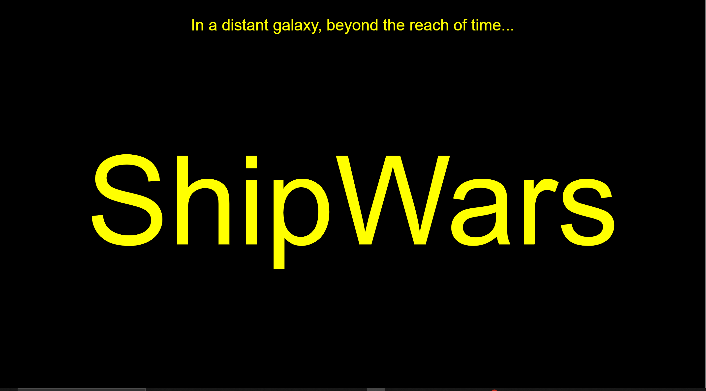

## Softwaredesign (Architektur)

Das Spiel wurde in einer Client-Client-Server-Architektur entwicklet, wobei der Client als WPF-Anwendung oder Website implementiert ist und diese beide mit dem Server (welcher auf Spring Boot basiert) kommunizieren. Die Daten werden in einer MongoDB-Datenbank gespeichert.

```mermaid
graph TD;
  A[WPF Client] <--> C[Spring Boot Server];
  B[Website Client] <--> C[Spring Boot Server];
  C[Spring Boot Server] <--> D[MongoDB Datenbank];
```

## Beschreibung der Software

Das Spiel (ShipWars) ermöglicht es Benutzern Schiffe zu verwalten (kaufen und verkaufen), sowie Berufe anzunehmen und Planeten zu besuchen. Es bietet eine benutzerfreundliche Oberfläche sowohl als Desktopanwendung (WPF) als auch als Webanwendung. Die Software überträgt die Daten natürlich verschlüsselt, sodass keiner Zugang zu den Benutzerdaten erhalten kann.

## Funktionen der Website

### Intro
Wenn man die Website startet ( oder neustartet) wir ein Intro abgespielt wo jegliche Informationen wiedergespiegelt werden in einer StarWars Art.

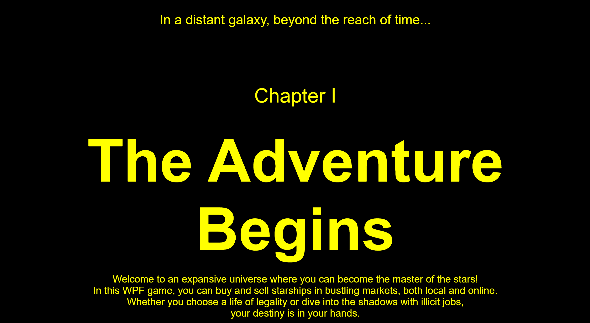
### Hauptfenster
Im Hauptfenster kann man ein paar Statistiken einsehen. Wie Spieler-, Raumschiff-, oder Planeten Statistiken. Wobei immer die Top fünf ausgegeben wird.
Beim Spieler werden fünf reichsten Spieler, die fünf Spieler mit den meisten Schiffen und die Spieler mit dem höchsten Level ausgegeben. Bei den Raumschiffen werden die teuersten und meist gekauften visualisiert. Ähnlich wie bei den Raumschiffen werden bei den Planeten auch die meist Bewohnten und meist besuchten Planeten ausgegeben.

## Funktionen der WPF

### Login
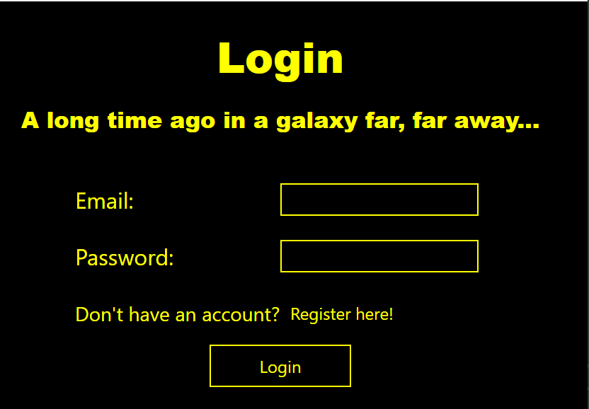<br>
In dem Eingabefeld neben dem Label **"Email: "** gibt man die regestierte Email-Adresse des zu verwendenten Benutzers ein<br>
In dem Eingabefeld neben dem Label **"Password: "** gibt man das Passwort des Benutzers ein<br>
Wenn man auf den **Register here!** Knopf neben **Don't have an account?** drückt, dann wird man zum Registrieren-Fenster weitergeleitet
Wenn man auf den **Login** Knopf drückt, dann werden die Daten überprüfft und wenn alles richtig ist zum Hauptfenster weitergeleitet.<br>


### Registrieren
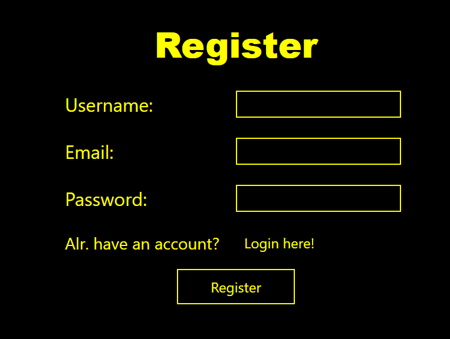<br>
In dem Eingabefeld neben dem Label **"Username: "** gibt man den Benutzernamen des zu erstellenden Benutzers ein.<br>
In dem Eingabefeld neben dem Label **"Email: "** gibt man die Email-Adresse des zu erstellenden Benutzers ein.<br>
In dem Eingabefeld unter dem Label **"Password: "** gibt man das Passwort des zu erstellenden Benutzers ein.<br>
Wenn man auf den **Login here!** Knopf neben dem **Alr.. have an account?** Text drückt, dann wird man zum Einloggen-Fenster weitergeleitet<br>
Wenn man auf den **Register** Knopf drückt, dann werden die eingegeben Daten überprüfft und Registriert. Dannach wird man wieder zum Login weitergeleitet.<br>

### Hauptfenster
<br>
#### Market Knopf
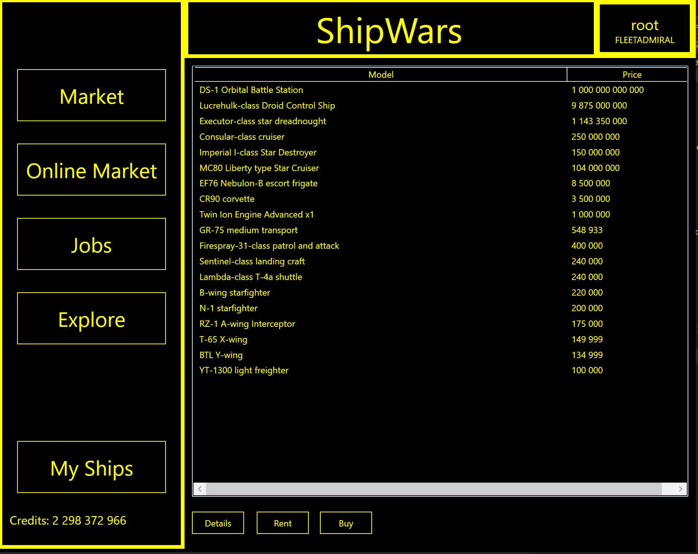
Wenn man auf den Knopf **Market** drückt, wird man zum Händler weitergeleitet. Beim Händler kann man verschiedene Schiffe anschauen und vergleichen. Man kann zwischen zwei Optionen beim Kauf wählen, ob man es direkt kaufen will, oder es ausleihen will.<br>
#### Detail: Knopf

#### Online Market Knopf
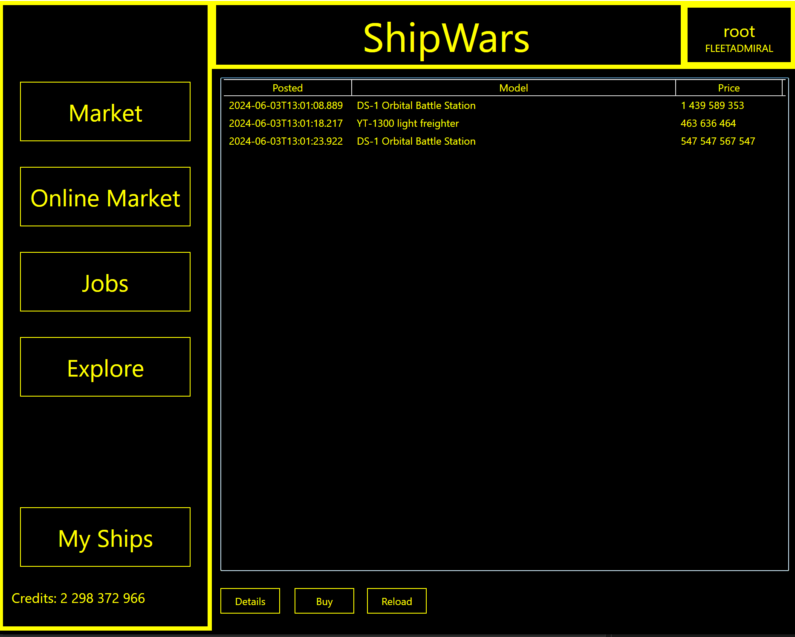
Wenn man auf den Knopf **Online Market** drückt, wird man zum Auktionshändler weitergeleitet. Beim Auktionshändler kann man verschiedene Schiffe anschauen und vergleichen, welche von anderen Benutzern verkauft werden. Man kann hier nur das Schiff direkt kaufen, wobei dann 100% des Geldes an den Verkäufer wieder geht.
#### Detail: Knopf
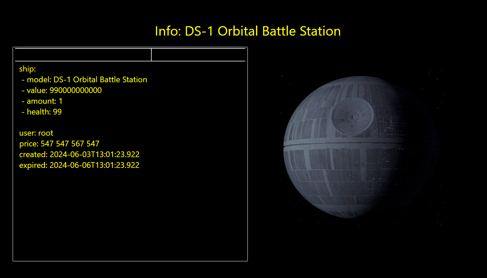<br>
#### Job Knopf
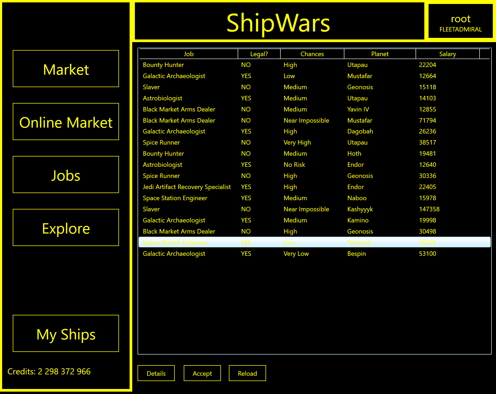
Wenn man auf den Knopf **Job** drückt, wird man zum Berufsmarkt weitergeleitet. Beim dem man zwischen verschiedene Berufe auswählen kann. Es gibt Legale und Illegale Jobangebote, wobei meistens die Illegalen rentabler sind, jeddoch auch die Chance eines Misserfolgs höher sind. Man kann die Details der Jobs vergleichen und auf Bedarf auch den Job annehmen. Bei einem nicht erfüllten Job werden 50% der Einnahmen als Strafe abgezogen vom Konto.<br>

#### Detail: Knopf

#### Explore Knopf

Wenn man auf den Knopf **Explore** drückt, wird man zur Planeten-Übersicht weitergeleitet. Man kann verschiedene Planeten vergleichen und besuchen, wobei man dafür ein Raumschiff besitzten muss. Bei jeder Reise wird 1% vom Leben des Schiffes abgezogen. Wenn man einen aktiven Job am Laufen hat, muss man den genannten Planeten hier besuchen um den Job zu absolvieren.<br>

#### Detail: Knopf
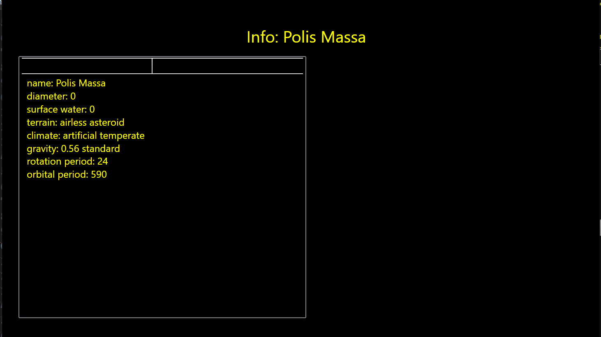

#### Travel: Knopf
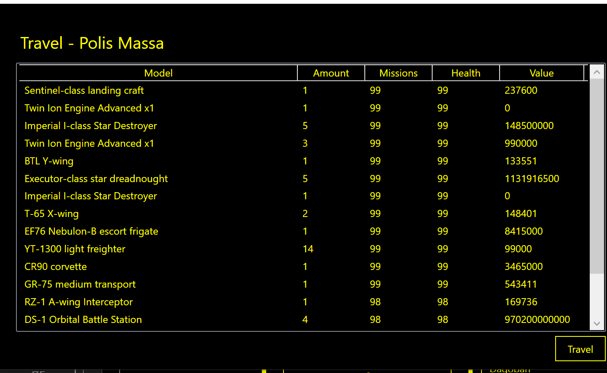
#### My Ships Knopf

Wenn man auf den Knopf **My Ships** drückt, kann man seine eigenen Schiffe sehen. Wenn ein Schiff den Wert 0 hat, wird es automatisch als geliehen anerkannt.<br>

#### Sell Online: Knopf
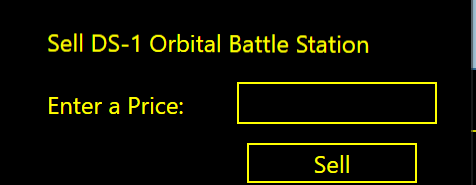

##  API-Beschreibung

Der Spring-Boot Server basiert auf dem REST-Pinzip.

### Die Endpunkte umfassen:


### User-Endpunkte:
(wichtigsten Endpunkte) zusammengefasst.
<!-- Genereller Endpoint -->
<details>
  <summary>/users []</summary>
  
  **Beschreibung:** Dieser Endpunkt ist der generelle Endpoint der User-Endpunkte, welcher vor dem jeweiligen spezifischen Endpoint geschrieben werden muss.
</details>
<!-- Benutzer -->
<details>
  <summary>/users [GET]</summary>
  
  **Beschreibung:** Dieser Endpunkt wird verwendet, um alle Benutzer zu holen. <br> <br>
  **Return-Wert:**
  ```json
  [
    {
        "username": "test",
        "level": 0,
        "role": "ENSIGNED",
        "email": "test@gmail.com",
        "password": "$2a$10$ShQfzBjWQEhEtOZFfuz",
        "credits": 50000,
        "friends": null,
        "ownedships": null
    },
    {
        "username": "111111",
        "level": 0,
        "role": "ENSIGNED",
        "email": "1111@gmail.com",
        "password":"$2a$10$o4btaziRvijBm7H6oH5uqYIGzP",
        "credits": 50000,
        "friends": null,
        "ownedships": null
    }
  ]
  ```
</details>
<details>
  <summary>/id/{id} [GET]</summary>
  
  **Beschreibung:** Dieser Endpoint wird verwendet, um einen bestimmten Benutzer zu bekommen.
  
  **JSON-Body:**
  ```json
  localhost:8080/users/id/664f05bbeb44c253b470f141
  ```

  **Return-Wert:**
  ```json
{
    "username": "test",
    "level": 0,
    "role": "ENSIGNED",
    "email": "test@gmail.com",
    "password": "$2a$10$geVnm8Y.JlmARSniWLuSJtN",
    "credits": 50000,
    "friends": null,
    "ownedships": null
}
  ```
</details>
<details>
  <summary>/name/{uname} [GET]</summary>
  
  **Beschreibung:** Dieser Endpoint wird verwedent, um einen bestimmten Benutzer mithilfe des Benutzernamens zu bekommen.
  
  **JSON-Body:**
  ```json
    localhost:8080/users/name/test
  ```

  **Return-Wert:**
  ```json
  {
    "id": "664f05bbeb44c253b470f141",
    "username": "test",
    "level": 0,
    "role": "ENSIGNED",
    "email": "test@gmail.com",
    "password": "$2a$10$geVnm8Y.JlmARLZpSniWLuSJi7",
    "credits": 50000,
    "friends": null,
    "ownedships": null
}
  ```
</details>
<details>
  <summary>/email/{email} [GET]</summary>
  
  **Beschreibung:** Dieser Endpoint wird verwendet, einen bestimmten Benutzer mithilfe der Email zu bekommen.
  
  **JSON-Body:**
  ```json
localhost:8080/users/email/test@gmail.com
  ```

  **Return-Wert:**
  ```json
  {
    "id": "664f05bbeb44c253b470f141",
    "username": "test",
    "level": 0,
    "role": "ENSIGNED",
    "email": "test@gmail.com",
    "password": "$2a$10$geVnm8Y.JlmARLZpSniWLuSJi7",
    "credits": 50000,
    "friends": null,
    "ownedships": null
}
  ```
</details>
<!-- Chat -->
<details>
  <summary>/unametoid/{uname} [GET]</summary>
  
  **Beschreibung:** Dieser Endpoint wurde verwendet, um die ID eines Benutzers mithilfe des Benutzernamens zu bekommen.
  
  **JSON-Body:**
  ```json
localhost:8080/users/unametoid/test
  ```

  **Return-Wert:**
  ```json
664f05bbeb44c253b470f141
  ```
</details>
<details>
  <summary>/password/{email}/{password} [GET]</summary>
  
  **Beschreibung:** Dieser Endpoint wurde verwendet, um zu überprüffen ob die Anmeldedaten korrekt sind.
  
  **JSON-Body:**
  ```json
localhost:8080/users/password/1@gmail.com/1
  ```

  **Return-Wert:**
  ###### Entweder:
  ```text
    "true"
  ```
  ###### Oder:
  ```text
    "false"
  ```
</details>
<details>
  <summary>/owned/get/{id} [GET]</summary>
  
  **Beschreibung:** Dieser Endpoint wurde verwendet, um alle Schiffe wiederzugeben, welcher der Benutzer besitzt.
  
  **JSON-Body:**
  ```json
localhost:8080/users/owned/get/660fb3b1a680d979538f5cfd
  ```

  **Return-Wert:**
  ```json
  [
    {
        "id": "65e9c0eac6757cc5caeec61b",
        "amount": 2,
        "model": "Sentinel-class landing craft",
        "value": "237600",
        "health": 99,
        "missions": 0,
        "rented": null
    },
    {
        "id": "65e9c1c0c6757cc5caeec61f",
        "amount": 1,
        "model": "Twin Ion Engine Advanced x1",
        "value": "0",
        "health": 99,
        "missions": 0,
        "rented": null
    }
  ]
  ```
</details>
<!-- Benutzer & Chat -->
<details>
  <summary>/users [POST]</summary>
  
  **Beschreibung:** Dieser Endpoint wurde verwendet, um einen neuen Benutzer zu erstellen.
  
  **JSON-Body:**
  ```json
  localhost:8080/users
  ```
  ```json
    {
      "username": "test4",
      "email": "test4@gmail.com",
      "password": "test"
    }
  ```

  **Return-Wert:**
  ```json
    {
      "id": "66576c133443c8197b3417ae",
      "username": "test4",
      "level": 0,
      "role": "ENSIGNED",
      "email": "test4@gmail.com",
      "password": "$2a$10$PfkE4JKEMaRVpnBDbhWO",
      "credits": 50000,
      "friends": null,
      "ownedships": null
  }
  ```
</details>
<details>
  <summary>/owned/remove/{uid}/{sid} [DELETE]</summary>
  
  **Beschreibung:** Dieser Endpoint wurde verwendet, um ein Schiff aus dem Besitz des users zu entfernen.
  
  **JSON-Body:**
  ```json
  localhost:8080/users/owned/remove/660fb3b1a680d979538f5cfd/65e9c0eac6757cc5caeec61b
  ```

  **Return-Wert:**
  ```text
    "true"
  ```

</details>


<br></br>
### Job-Endpunkte:
<details>
  <summary>/jobs []</summary>
  
  **Beschreibung:** Dieser Endpoint ist der Standard Pfad für alle Job Entpunkte.

</details>
<details>
  <summary>/jobs [GET]</summary>
  
  **Beschreibung:** Dieser Endpoint wurde verwendet, um alle Jobs zu bekommen.
  
  **JSON-Body:**
  ```json
  localhost:8080/jobs
  ```

  **Return-Wert:**
  ```json
  [
    {
        "id": "65f80eda20a0d436d6ef6c76",
        "job": "Space_Station_Engineer",
        "planetId": "65f801d11bcb3fee8e5efd1b",
        "legalStatus": "Legal",
        "risk": "Very_Low",
        "min_success": 95,
        "max_success": 98,
        "real_success": 95,
        "description": "Join the...",
        "salary": 16028
    },
    {
        "id": "65f80edc20a0d436d6ef6c79",
        "job": "Bounty_Hunter",
        "planetId": "65f8028f1bcb3fee8e5efd1f",
        "legalStatus": "Illegal",
        "risk": "High",
        "min_success": 40,
        "max_success": 60,
        "real_success": 57,
        "description": "Embark on...",
        "salary": 22204
    }
  ]
  ```
</details>
<details>
  <summary>/checkAvailability{id} [GET]</summary>
  
  **Beschreibung:** Dieser Endpoint wurde verwendet, um zu uberprüffen, ob ein Job bereits vergeben ist oder noch frei ist. Da die WPF-Anwendung sich nicht automatisch updated, kann es passieren, dass der Job bereits vergeben ist, jedoch noch in der WPF sichtbar ist, dieser Entpoint verhindert dies.
  
  **JSON-Body:**
  ```json
localhost:8080/jobs/checkAvailability/65f80ea920a0d436d6ef6c73
  ```

  **Return-Wert:**
  ###### Entweder:
  ```text
    "true"
  ```
  ###### Oder:
  ```text
    "false"
  ```
</details>
<details>
  <summary>/deleteMessage [DELETE]</summary>
  
  **Beschreibung:** Dieser Endpoint wurde verwendet, um einen Job anzunehmen.
  
  **JSON-Body:**
  ```json
localhost:8080/jobs/accept/65f80eda20a0d436d6ef6c76
  ```

  **Return-Wert:**
  ```json
    {
    "id": "65f80eda20a0d436d6ef6c76",
    "job": "Space_Station_Engineer",
    "planetId": "65f801d11bcb3fee8e5efd1b",
    "legalStatus": "Legal",
    "risk": "Very_Low",
    "min_success": 95,
    "max_success": 98,
    "real_success": 95,
    "description": "Join the elite team...",
    "salary": 16028
}
  ```
</details>
<details>
  <summary>/delete/{id} [DELETE]</summary>
  
  **Beschreibung:** Dieser Endpoint wurde verwendet, um einen Job zu entfernen.
  
  **JSON-Body:**
  ```json
localhost:8080/jobs/65f80eda20a0d436d6ef6c76
  ```

  **Return-Wert:**
  ###### Entweder:
  ```text
    "true"
  ```
  ###### Oder:
  ```text
    "false"
  ```
</details>

<br></br>
### Ship-Endpunkte:
<details>
  <summary>/ships []</summary>
  
  **Beschreibung:** Dieser Endpoint ist der Standart-Endpunkt für alle anderen.
</details>
<details>
  <summary>/ships [GET]</summary>
  
  **Beschreibung:** Dieser Endpoint wurde verwendet, um alle Schiffe zu bekommen.
  
  **JSON-Body:**
  ```json
localhost:8080/ships
  ```
</details>
<details>
  <summary>/{id} [GET]</summary>
  
  **Beschreibung:** Dieser Endpoint wurde verwendet, um ein Schiff zu bekommen.
  
  **JSON-Body:**
  ```json
localhost:8080/ships/65e9bffac6757cc5caeec618
  ```
</details>
<details>
  <summary>/ships [POST]</summary>
  
  **Beschreibung:** Dieser Endpoint wurde verwendet, um ein Schiff hinzuzufügen.
  
  **JSON-Body:**
  ```json
localhost:8080/ships
  ```
  ```json
  
model:"DS-1 Orbital Battle Station"
starship_class:"Deep Space Mobile Battlestation"
manufacturer:"Imperial Department of Military Research, Sienar Fleet Systems"
cost_in_credits
"1000000000000"
length
"120000"
crew
"342,953"
passengers
"843,342"
max_atmosphering_speed
"n/a"
hyperdrive_rating
"4.0"
MGLT
"10"
cargo_capacity
"1000000000000"
consumables
"3 years"
name
"Death Star"
  ```
</details>


## Verwendung der API

Unterhalb ist die Topologie und Code-Blöcke, welche das Erstellen eines Jobs darstellt. 

### Topologie für Login in ShipWars 
```mermaid
classDiagram
  MongoDB-Datenbank -- Spring-Boot-Server
  Spring-Boot-Server -- WPF-Client
  WPF-Client o-- Login_WPF
```

<br>


<details>
  <Summary>Job-Erstellen</summary>

  **Beschreibung:** Dieser Code erstellt einen Job automatisch. 

  **Java-Code:**
 ```java
    public Job createJob() {
        Job job = new Job();
        Random rand = new Random();
        int randInt = rand.nextInt(2);

        if(randInt == 0) { 
          //LegalJobs
            randInt = rand.nextInt(LegalJobs.values().length);
            job.setJob(String.valueOf(LegalJobs.values()[randInt]));
            job.setLegalStatus("Legal");
            randInt = rand.nextInt(LegalRisks.values().length);
            job.setRisk(String.valueOf(LegalRisks.values()[randInt]));
            this.setDescription(job);
            this.setSuccess(job);
        }
        else if(randInt == 1) { 
          //IllegalJobs
           randInt = rand.nextInt(   IllegalJobs.values().length);
            job.setJob(String.valueOf(IllegalJobs.values()[randInt]));
            job.setLegalStatus("Illegal");
            randInt = rand.nextInt(IllegalRisks.values().length);
            job.setRisk(String.valueOf(IllegalRisks.values()[randInt]));
            this.setDescription(job);
            this.setSuccess(job);
        }
        //Set Planet
        List<Planet> planetList = planetRepository.findAll();
        randInt = rand.nextInt(planetList.size());
        Planet planet = planetList.get(randInt);
        job.setPlanetId(planetList.get(randInt).getId());

        //Set RealSuccess
        randInt = rand.nextInt(job.getMax_success() - job.getMin_success() + 1) + job.getMin_success();
        job.setReal_success(randInt);

        //Set Salary
        if(randInt == 0) { randInt = 1; }
        float randNum = randInt;
        int baseSal = 10000;
        if(Objects.equals(planet.getDiameter(), "0")) { planet.setDiameter("1");}
        float salary = baseSal / (randNum / 100) + rand.nextInt(Integer.parseInt(planet.getDiameter()));
        job.setSalary((int)salary);
        return jobRepository.save(job);
    }
  ```
  **Java-Code:**
 ```java
     private void setSuccess(Job job) {
        Gson gson = new Gson();
        try (FileReader reader = new FileReader("./JSONS/job_risk.json")){
            Risk_DTO[] risks = gson.fromJson(reader,(Type) Risk_DTO[].class);
            for(Risk_DTO r : risks) {
                if(r.getRisk().equals(job.getRisk())) {
                    job.setMin_success(Integer.parseInt(r.getMin_success()));
                    job.setMax_success(Integer.parseInt(r.getMax_success()));
                    return;
                }
            }
        } catch (IOException ex) {
            ex.printStackTrace();
        }
    }
  ```
  **Java-Code:**
  ```java
  package com.example.syp.shipwars.semesterproject;

import com.example.syp.shipwars.semesterproject.Repositories.ShipsOnSaleRepository;
import com.example.syp.shipwars.semesterproject.Services.ShipsOnSaleService;
import org.springframework.beans.factory.annotation.Autowired;
import org.springframework.scheduling.annotation.Scheduled;
import org.springframework.stereotype.Component;

import java.util.List;

@Component
public class SheduledTask {
    @Autowired
    private ShipsOnSaleService shipsOnSaleService;

    @Scheduled(fixedRate = 30000)
    public void checkExpiredDate() {
        shipsOnSaleService.prozessExpiredShips();
    }
}

  ```
</details>

## Diskussion der Ergebnisse
Nach ca. 2 Monaten und 3616 Zeilen Code in mehreren verschiedenen Programmier- & Scriptsprachen stelle ich die Erste Version meines Spiels (ShipWars) vor. Das Game hat eine intuative Benutzeroberfläche und eine Echtzeitkommunikation. Die Daten werden sicher in einer MongoDB-Datenbank gespeichert. Das Passwort wird im Server gehashed gespeichert. Durch das verschlüsseln der Daten ist eine Sichere speicherung garantiert.


 //Fertig

### Zusammenfassung
ShipWars stellt eine intuitive Benutzeroberfläche für sämtliche Platformen zur Verfügung. Die REST-API des Spring-Boot Servers ermöglicht die Echtzeitkommunikation zwischen den Clients und der Datenbank.

### Hintergründe
Bei der Entwicklung der Spiels wurde der Fokus auf den Marktplatz und Reisen gelegt. Durch die Verwendung aktueller Technologien wie Spring-Boot, WPF, HTML, CSS, JSON & JavaScript wird die zukünftige Unterstützung gewährleistet. Die Nutzung einer MongoDB-Datenbank sorgt ebenfalls für die sichere Speicherung der Daten & effiziente Datenverwaltung.

### Ausblicke
In Zukunft soll das Spiel auch noch die möglichlkeit haben, Freunde hinzuzufügen (im Code bereits vorhanden) und einen 1gegen1 Modus zu besitzten. Ebenfalls soll ein das Spiel auch in einer WebApp spielbar sein und ein kleines Online-Forum mit hilfreichen beiträgen und Chats beinhalten. Durch Einbeziehen des Benutzerfeedbacks wird die Benutzerfreundlichkeit ebenfalls stark erhöht werden. TinyWhatsApp soll in Zukunft eine führende Plattform für sichere und benutzerfreundliche Echtzeitkommunikation werden.

## Diagramme

### Klassendiagramm des WPF-Clients
```mermaid
classDiagram
    Main o-- Login
    Main o-- Register
    Main o-- Details
    Main o-- Travel
    Main o-- Buy-Online
```

### Klassendiagramm des Spring-Boot Servers
```mermaid
classDiagram
    Application o-- UserController
    Application o-- ShipController
    Application o-- ShipsOnSaleController
    Application o-- PlanetController
    Application o-- JobController
    UserController o-- UserService
    ShipController o-- ShipService
    ShipsOnSaleController o-- ShipsOnSaleService
    PlanetController o-- PlanetService
    JobController o-- JobService
    UserService o-- UserRepository
    UserService o-- ShipService
    UserService o-- ShipsOnSaleService
    UserService o-- PasswordEncoder
    ShipService o-- ShipRepository
    ShipsOnSaleService o-- ShipsOnSaleRepository
    PlanetService o-- PlanetRepository
    JobService o-- JobRepository
    JobService o-- PlanetRepository
    MongoDBRepository <-- UserRepository
    MongoDBRepository <-- ShipRepository
    MongoDBRepository <-- ShipsOnSaleRepository
    MongoDBRepository <-- PlanetRepository
    MongoDBRepository <-- JobRepository
```

## Quellenverzeichnis

### Spring-Boot Server
#### [Spring-Boot]()
#### [JSON](https://www.json.org/json-en.html)

### WPF-Client
#### [C#](https://learn.microsoft.com/de-de/dotnet/csharp/)
#### [JSON](https://www.json.org/json-en.html)

### WebApp-Client
#### [HTML](https://developer.mozilla.org/en-US/docs/Web/HTML)
#### [CSS](https://developer.mozilla.org/en-US/docs/Web/CSS)
#### [JavaScript](https://developer.mozilla.org/en-US/docs/Web/JavaScript)

### MongoDB Datenbank
#### [MongoDB](https://www.mongodb.com/docs/)

### IDEs
#### [IntelliJ IDEA 2024.1.1](https://www.jetbrains.com/idea/download/download-thanks.html?platform=windows)

#### [Visual Studio 2022 17.9.7](https://visualstudio.microsoft.com/de/thank-you-downloading-visual-studio/?sku=Community&channel=Release&version=VS2022&source=VSLandingPage&cid=2030&passive=false)